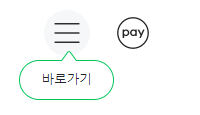

# NAVER 사이트 클론코딩

1. ### 프로젝트 시작 날짜 : 2024. 2. 26.~</br>
2. ### header부분 수정 : 2024. 3. 19.~</br>
3. ### main 부분 추가 : 2024. 3. 20.~

---

프론트엔드를 공부하면서 내가 가장 많이 이용하는 `naver`사이트를 클론코딩하기로 했다. 먼저 `html`, `css`, `js`로 구현할 수 있는 부분들은 최대한 구현해보고 후에 배울 기술들을 추가로 적용할 예정이고, 코드 재사용성을 고려해서 최종적으로 구현해 볼 생각이다.

엄청 디테일한 부분은 제쳐두고 먼저 구현해야 할 중요 기능들을 중점적으로 구현해보려고 노력했다. 

--- 

# 1. Header Section
  <br>
  먼저 header부분이다. `nav-bar`, `검색창`, `바로가기 아이콘`등을 구현해야 했다. 각종 아이콘들은 아이콘 모음 `png`파일에서 `background position`을 이용하여 사용하고 있었다. 먼저 png파일을 사용자 도구에서 다운받아 그대로 사용하였다.

  그리고 검색바 밑에 아이콘들은 아이콘 겉에 테두리를 넣은게 아니라 큰 아이콘 안에 작은 아이콘을 넣어야했다. 아이콘 전부를 `absolute`를 이용해 위치를 조정해 주었다.

  먼저 기본적인 배치는 `display : flex`를 이용했다. 배치와 더불어 `header`부분에 몇 가지 이벤트 들이 있었는데


## 1) navbar mouse 이벤트

   - navbar icon에 `hover`시 `background color`가 변하고 숨겨진 `<div>` 출력해야한다.

  <p align="center"></p>

  - `click` 했을 때, 숨겨졌던 `div` 출력<br><br>
   여기서 아이콘을 클릭한 후에는 다시 `hover`했을 때 `hover <div>`는 나오면 안되고 다른 icon을 `hover`했을 때 기존 클릭 div 보다 앞쪽에 출력되야 했다.

## 2) 검색창, 바로가기 아이콘 hover 이벤트

  - 검색창과 바로가기 아이콘에 마우스를 `hover` 했을 때 미세하게 그림자가 지는 것을 구현해야 했다.

  <p align="center"></p>

```css
box-shadow: 0 2px 4px 0 rgba(0,0,0,.12);
```

# 2. Main Section
 main 부분에서는 좌 우로 section이 나누어져 있었다. `<div>`를 좌우로 나누어 구성하였고, 좌측에는 news, 쇼핑, 웹툰 등이 있었고, 우측에는 로그인, 날씨, 증시 등이 있었다. 좌측 section 뉴스 section에서 구현해야 할 animation이 있었다.

  <p align="center"></p>

 ## 1) translate 애니메이션

 <p align="center"></p>

  중간에 뉴스 속보 헤드라인이 변하는 animation을 구현해야 했다. 실제로 이렇게 구현되었는지 모르겠지만, 나는 `transform`속성 중에서 `translateY`을 이용했다. 먼저 크기가 큰 `<div>`를 준비하고 배경을 넘어가면 안 보이도록 `overflow : hidden` 속성을 주었다. 그렇게 되면 하나의 헤드라인만 보이게 되었고, js로 `setInterval`을 통해 주기적으로 위치를 이동시켜 주었다.

   ```js
  let translateDiv = $('.translateDiv');

  let data = [
    `<p>한국 선적 수송선, 일본 혼슈 앞바다서 전복</p>`,
    `<p>의대 2천명 증원 쐐기</p>`,
    `<p>퀴어축제, 올해는 서울광장서 열릴까</p>`,
    `<p>복지장관 "협상 위해 미래 희생 못해..".</p>`,
    `<p>핀란드 세계 행복순위 7년연속 1위</p>`,
    `<p>전공의 복귀 설득했다. 교슈 사진 실명공개</p>`,
  ]

  let count = 0;

  data.map((val, num) => {
    translateDiv.append(val);
    })

  setInterval(() => {
    translateDiv.css('transform',`translateY(${-(count++ * 30)-6}px)`)
      if(count == data.length){
        count=0;
        }
  },5000)
   ```

   헤드라인 데이터를 뉴스 서버에서 받아온 후에 `data` `array`에 담아 놓은 다음 `<div>`에 요소들을 전부 `append` 해주었다. (현재는 직접 데이터를 작성 함. 나중에 ajax요청을 통해 자동으로 변환되도록 바꿔야 할 거 같음) 그리고 `setInterval`에서 5초마다 계속 반복되도록 설정해 두었고, 이 때 `<div>`가 점진적으로 `translateY`되도록 설정해 두었다. 이 때 `count`변수는 `array`를 모두 보여줬을 때 다시 처음 으로 돌아가도록 `if(count == data.length)`라는 조건문을 걸어 0으로 다시 세팅되도록 두었다.
